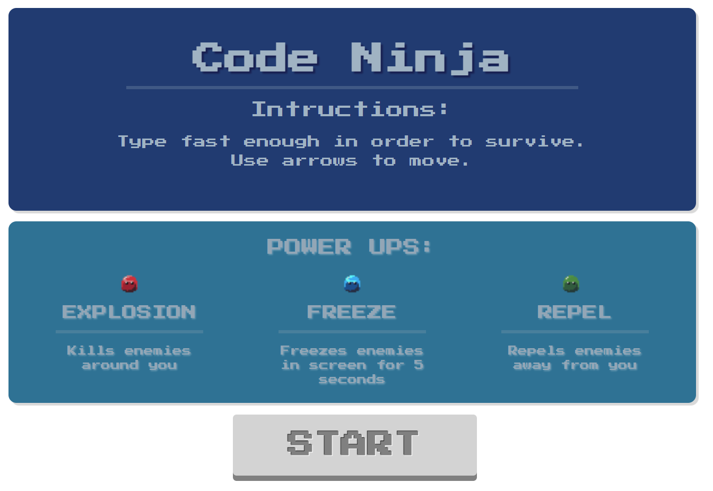

# Code Ninja. A JavaScript web based game

Developed by Miguel Ortega Ward and Jean Carlo Noguera (https://github.com/VmMad).

-----

Using  HTML5 · CSS3 · JAVASCRIPT · CANVAS

### `Try it here!` https://miguelow.github.io/code-ninja/

Code Ninja is a TypeRacer based game where you have to type the word that appear in the screen and survive as much as you can! There are 3 PowerUps that may help you on this adventure. The red blob, that eliminates enemies around you in a small radius. the blue blob, that freezes all the enemies in the screen so you can eliminate them easier, and the green blob, repels enemies far from you..

Hope this game helps you as much as it helped us to write code faster :D
